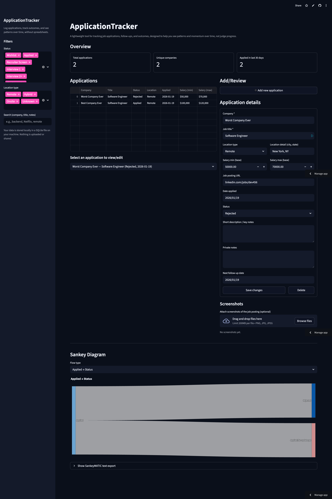

# ApplicationTracker  
*A lightweight job application tracker built with Streamlit & Supabase.*

ApplicationTracker is a clean, focused Streamlit app that helps you log job applications, track follow-ups and outcomes, and actually see your progress without spreadsheets, scattered bookmarks, or trying to remember whether you already applied somewhere.

## Features

### Clean Application Logging
Store all key details in one place:

- Company & role  
- Salary range  
- Job posting link  
- Short description or highlights  
- Notes & red flags  
- Follow-up reminders  
- Status (Applied > Screens > Interviews > Offer > etc.)  
- Screenshot attachments of job postings  

Your data is stored in a structured Postgres database backed by Supabase.

### Visual Insights

Built-in visualizations give you perspective at a glance:

- Total applications  
- Unique companies  
- Applications submitted in the last 30 days  
- Cumulative applications over time  
- Applications by location type (Remote/Hybrid/Onsite)  

These charts make it easier to spot real patterns and momentum instead of guessing how your search is going.

### Sankey Diagram

A Sankey diagram visualizes how your applications flow from Applied into different outcomes:

- Recruiter screens  
- Interviews  
- Offers  
- Rejections  
- Ghosted  

This gives you a big-picture view of where applications tend to stall or convert.

### Powerful Filtering

Filter your applications by:

- Status  
- Location type  
- Free-text search (company, role, notes)  

Designed to stay fast and usable even as your application list grows.

## 🛡️ How Your Data Is Stored

ApplicationTracker uses Supabase as its database backend.

What that means in practice:

- Your data is stored in a real Postgres database, not in-memory or tied to a single app session  
- The app connects securely using environment-based credentials  
- Your data persists across restarts, redeploys, and app sleeps  
- The schema lives in Supabase, not in application code  

## Tech Stack
- **Language:** Python 3.14
- **Frontend:** Streamlit
- **Data & Storage:** 
  - Supabase: Persistent database backend
  - SQLAlchemy: Database engine & queries
  - psycopg2-binary: Postgres driver
- **Data Processing:**
  - pandas: Tabular data manipulation
  - numpy: Numeric helpers & data prep
- **Visualization:**
  - Plotly: Charts & visual insights
  - Pillow: Image handling for job posting screenshots